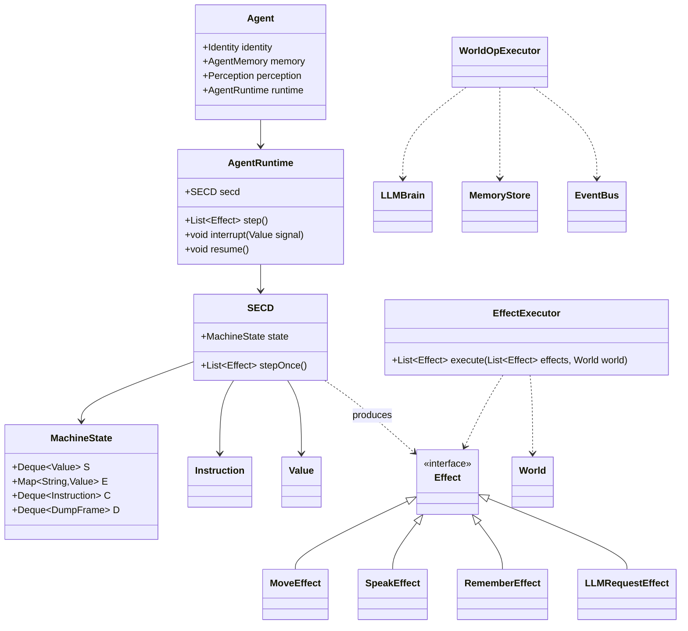

# SECD 行为运行时 × Virtual AI Box —— 融合设计方案

> 版本：v0.3（评审修订稿 + P6 设计）
> 依据：`docs/my_opinion.md` 审查意见逐条落实
> 状态：待定稿

---

## 1. 项目定位（一句话）

> **这是一个以 SECD 为行为执行内核、以 World/Event 为运行环境、以 Memory 为认知状态、以 Effect 为副作用边界、以 LLM 为非确定性 Oracle 的多智能体沙盒。**

---

## 2. 定位修正（落实评审 §1）

- ~~"把每个 Agent 变成一台 SECD 抽象机"~~ —— 不采用。
- 准确表述：

> **每个 Agent 拥有一个基于 SECD 的行为运行时（Agent Runtime），负责执行可组合、可中断、可恢复的行为程序。**

- **SECD 是 Agent 的行为执行内核，而不是 Agent 本身。**
- 由此，原 AI 小镇、Tick、EventBus、Memory、Agent 与 SECD 抽象机**都不被推翻**，各自进入清晰位置。

---

## 3. 职责划分（落实评审 §4）

| 关注点 | 归属 |
|---|---|
| 行为控制流 | **SECD**（确定性执行内核） |
| 世界状态 | **World**（运行环境） |
| 记忆 | **Memory**（外部认知状态） |
| 不确定性 | **LLM**（非确定性 Oracle） |
| 副作用边界 | **Effect**（意图/副作用描述） |

> **Deterministic Runtime + Non-deterministic Oracle**

```text
SECD
 ↓ 执行确定性的行为程序
 ↓ 遇到 ask-llm
LLM
 ↓ 返回结果
 ↓ 继续 SECD
```

---

## 4. S/E/C/D 保持 SECD 原始语义（落实评审 §2）

**不把 S/E/C/D 强行等同于记忆、人格。** 四个寄存器只表达"当前行为执行的机械状态"：

| 寄存器 | 真正职责 |
|---|---|
| **S** | 当前计算过程中的**值栈** |
| **E** | 当前程序的**词法环境 / 闭包环境** |
| **C** | 当前正在执行的**行为程序**（指令序列） |
| **D** | **continuation**：被挂起的执行上下文 |

Agent 的组成（认知状态与执行状态分离）：

```text
Agent
├── Identity / Personality    （身份/人格，静态）
├── AgentMemory               （记忆，外部认知状态）
├── Perception                （感知，输入通道）
└── AgentRuntime              （行为执行内核）
     └── SECD                 （S / E / C / D）
```

**重要约束：Memory ≠ E，ShortTermMemory ≠ S。**
Memory 是外部认知状态（AgentMemory/MemoryStore），SECD 是行为执行状态（S/E/C/D）。两者之间只通过 Effect 与指令原语交换数据，不做概念合并。

---

## 5. 技术亮点：D 栈 = Interrupt → Handle → Resume（落实评审 §3）

这是整个融合最有价值、最值得深挖的能力，保留并作为项目技术亮点：

```text
Alice：move east; move east; move east
      ↓
Bob 出现（World Event 触发）
      ↓
AgentRuntime：
  D.push(当前执行上下文)
      ↓
  执行 onMeet(Bob)
      ↓
  对话结束
      ↓
  resume()
      ↓
  继续 move east
```

这让 Agent 真正拥有 **Interrupt → Handle Event → Resume**，而不再是每个 tick 都让 LLM 猜"我现在应该干什么"。

---

## 6. LLM 是 Oracle，不是 Runtime（落实评审 §4）

保留原文档最重要的思想：

> **LLM 是 Oracle，而不是 Agent Runtime。**

```text
行为控制流 → SECD
世界状态   → World
记忆       → Memory
不确定性   → LLM
```

LLM 只在 `ask-llm` 原语处被调用一次，把结果作为值返回 SECD 继续执行。控制流全部由机器保证。

---

## 7. Effect 层：隔离 SECD 与世界副作用（落实评审 §5）

**禁止 SECD 直接修改 World。** 单向数据流：

```text
SECD
 ↓ 产生 Effect（意图/副作用描述）
Tick / Effect Executor
 ↓ 真正执行副作用
修改 World
```

Effect 类型（v0）：

```text
MoveEffect      → Movement（对应现有 MoveAction）
SpeakEffect     → EventBus 广播
RememberEffect  → Memory（AgentMemory/MemoryStore）
LLMRequest      → LLM（ask-llm 的副作用化）
ObserveEffect   → Perception → S 栈（⚠️ P6 起改为**只读感知原语**，不产 Effect —— 见 §17）
```

对应关系：

```text
SECD          = 计算
Effect        = 意图/副作用描述
EffectExecutor = 真正执行副作用
WorldState    = 世界状态
```

**收益**：原有 5 阶段 Tick 骨架完整保留 —— `decisionPhase` 产出 Effects，`executionPhase` 由 EffectExecutor 落地。

---

## 8. 交互触发链（严谨表述，落实评审 §6）

不宣称"Agent 交互本质上就是 β-归约"，改为：

> **世界事件可以触发 Agent 行为闭包的应用，并由 SECD 执行归约。**

```text
Agent 相遇
    ↓
World Event
    ↓
找到 A.onMeet
    ↓
apply(onMeet, B)
    ↓
SECD reduction
    ↓
Effects
    ↓
World
```

既保留理论特色，又不把 λ 演算与社会交互强行画等号。

---

## 9. 收敛：不动点 / 稳定性 / 活锁检测（落实评审 §7）

**不把"AI 小镇 = λ 演算 normalization"当严格理论**（动态系统不一定存在 normal form）。归一化思想保留，工程实现表述为：

| 工程概念 | 含义 | 检测事件 |
|---|---|---|
| **Fixed Point / Stability** | `WorldState(t)` 长期无变化 | `WorldConverged` |
| **Loop Detection** | 状态进入周期 `A→B→A→B→…` | `AgentLoop` / `AgentStuck` |

```text
WorldState(t)   →   WorldState(t+1)   →   WorldState(t+2)
       长期无变化 → WorldConverged
       A→B→A→B…  → AgentLoop / AgentStuck
```

---

## 10. 行为 DSL v0（最小范围，草案，落实评审 §8）

第一阶段**不做**完整编程语言（Lexer/Parser/AST/TypeSystem）。只支持：

```text
move  speak  observe  remember  ask-llm
sequence  if  lambda  apply
```

目标管线先跑通：

```text
.lambda → Parser → Compiler → SECD → Effect → World
```

> ⚠️ **状态标注：行为 DSL 是草案，不是项目核心。** 语法后续可调整。

### 10.1 语法（v0，已与示例对齐）

```text
program   := topLevel+
topLevel  := def (';')? | plan (';')?
def       := NAME '=' expr
plan      := 'plan' '=' expr
expr      := INT | STRING | NAME | DIRECTION
           | op
           | '(' expr expr ')'                     # 应用
           | ('λ'|'lambda'|'L') NAME '.' expr      # 抽象
           | 'let' NAME '=' expr 'in' expr
           | 'if' expr 'then' expr 'else' expr
           | '{' expr (';' expr)* '}'              # 顺序 → InstSeq
op        := 'move' | 'speak' | 'observe' | 'remember' | 'ask-llm'
           | 'name-of' | 'dist-to'
DIRECTION := 'north' | 'east' | 'south' | 'west'    # 由 EffectExecutor 映射为 delta
```

### 10.2 示例：Alice（与语法严格一致）

```text
# Alice.lambda
persona   = λ p. (remember (name-of p) "met")
assistant = λ p. (speak p (ask-llm p))
explore   = λ d. (move d)
onMeet    = λ p. { persona p; assistant p }
onIdle    = λ d. { explore d }
plan      = { onIdle east; onIdle east; onIdle north; onIdle north }
```

- 规则都是**值**（闭包），可组合：`onMeet` = `persona` 与 `assistant` 的复合。
- 解析器选型（P5 改为 ANTLR）：~~手写递归下降解析器~~ → **ANTLR 4.13.2**（`antlr4-maven-plugin` 生成
  Lexer/Parser），避免手写解析器的优先级/错误恢复等边界风险；语法由 `src/main/antlr4/.../BehaviorDSL.g4` 定义。
  DSL 收敛见 §14 P5 记录（move 变参应用 / plan 用运行时变量 dx/dy）；`if` 保留字在 **P6** 实现（§17），
  `observe/name-of/dist-to/方向常量` 由 P6 的感知原语落地。

---

## 11. 总体架构（评审最终版）

```
                         Virtual AI Box
                              │
                         World Engine
                              │
                             Tick
                              │
              ┌───────────────┴───────────────┐
              │                               │
           Agent A                         Agent B
              │                               │
        ┌─────┴─────┐                   ┌─────┴─────┐
        │ AgentMind  │                   │ AgentMind  │
        │            │                   │            │
        │   SECD     │                   │   SECD     │
        │ S E C D    │                   │ S E C D    │
        └─────┬──────┘                   └─────┬──────┘
              │                               │
              └─────────── Effects ───────────┘
                              │
                       Effect Executor
                              │
                ┌─────────────┼─────────────┐
                ↓             ↓             ↓
             Movement      EventBus       Memory
                │             │             │
                └─────────────┼─────────────┘
                              ↓
                         WorldState


                     ┌──────────────┐
                     │     LLM      │
                     └──────┬───────┘
                            │
                        ask-llm()
                            │
                            ↓
                           SECD
```

---

## 12. 包结构设计（v0.2 修订）



包路径：`com.own.virtualaibox.secd`（移植）+ `com.own.virtualaibox.mind`（AgentRuntime / AgentMind / Perception）+ `com.own.virtualaibox.effect`（Effect 层，新增）+ `com.own.virtualaibox.dsl`（Parser / Compiler）。

> 注：评审图中 Agent 内层叫 `AgentMind`，本方案的 `AgentRuntime` 与 `AgentMind` 等价，命名以定稿时二选一。

---

## 13. 迁移路线（移植 + 精简）

沿用 v0.1 结论，按"移植 + 精简"落地。

### 13.1 直接移植（语义不变，仅调包名/泛型，兼容 Java 21）

| lambdaexpr 文件 | 目标 | 说明 |
|---|---|---|
| `instruction/Instruction.java` | `secd/Instruction.java` | 标记接口 |
| `InstConst / InstVar / InstLam / InstApp / InstApply` | `secd/*.java` | 原样 |
| `value/Value.java` | `secd/value/Value.java` | 原样 |
| `IntValue / VarValue / OpValue / PartialOpValue / ClosureValue / InfiniteValue` | `secd/value/*.java` | 原样 |
| `core/SECDMachine.java` | `secd/SECD.java` + `secd/MachineState.java` | **拆分**：状态与驱动分离，去掉 ANTLR 耦合；`step()` 改为**产出 Effect** |
| `core/DumpItem.java` | `secd/DumpFrame.java` | 重命名 |

### 13.2 精简 / 重写
| lambdaexpr 文件 | 处理 |
|---|---|
| `gen/*`（ANTLR 生成） | **删除**，由 `src/main/antlr4/.../BehaviorDSL.g4` 重新生成（P5） |
| `core/ASTBuilder.java`（α-改名） | 重写为 `behaviordsl/BehaviorCompiler`（语法树 → SECD Instruction，命名变量，作用域卫生） |
| `Main.java`（Swing UI） | **删除** |
| 无限归约启发式 | 提炼进 `ConvergenceMonitor`（§9） |

### 13.3 依赖与构建
- **引入 ANTLR**（P5 起）：`org.antlr:antlr4-runtime`（4.13.2）运行时依赖 +
  `antlr4-maven-plugin`（4.13.2）代码生成到 `target/generated-sources/antlr4`。
- 保留 `ClosureValue.toString()` 递归打印（前端摘要需要）。
- 移植源 Java 11 → 本项目 Java 21，无兼容问题。

---

## 14. 实现阶段

| 阶段 | 内容 | 验收 |
|---|---|---|
| **P0 移植** | SECD 核心移植进 `com.own.virtualaibox.secd`，拆分 `MachineState`/`SECD`，`step()` 产出 Effect | 移植原 `JunitTest` 用例通过；`step()` 不再直接改 World，只产出 Effect |
| **P1 运行时** | `AgentRuntime` + Effect 层 + `EffectExecutor`；每 Agent 一个 SECD；decisionPhase → Effects → executionPhase 落地 | 心智驱动代替直接 LLM 决策，世界仍能跑动；行为控制流与副作用完全隔离 |
| **P2 中断/恢复** | World Event → apply(onMeet) → `interrupt/resume` | 相遇出现对话；Agent 计划可被中断并恢复（单测验证 D 栈出入） |
| **P3 收敛检测** | `ConvergenceMonitor` + `WorldConverged` / `AgentLoop` / `AgentStuck` | 构造"原地打转/周期振荡"Agent，能检出 |
| **P4 可视化** | dashboard 暴露 SECD 状态（S/E/C/D 摘要 + 状态）；`MindViewer` + 收敛指示器 | 前端可见每 Agent 的行为执行状态（已完成，用户测试通过） |
| **P5 配置化** | `resources/agents/*.lambda` 启动加载（ANTLR 解析） | 改 `.lambda` 文件重启即变人格，无需改代码（代码完成，待测试） |
| **P6 感知与条件** | Perception 只读世界视图（self/closest/dist-to/name-of/direction-of）+ 比较原语（eq/lt/gt/le/ge）+ `if/then/else` + 方向常量移动 | `if` 不再是保留字；`.lambda` 可写"附近有人则打招呼、否则移动"的反应式行为（设计见 §17，待实现） |

每阶段保持可运行、可回退（配置开关）。

---

## 15. 风险与缓解

| 风险 | 缓解 |
|---|---|
| LLM 非确定性破坏机械可靠承诺 | LLM 只填 `ask-llm` 一个洞；控制流由 SECD 保证（§6） |
| SECD 直接改 World 造成耦合 | **Effect 层硬隔离**（§7），单向数据流 |
| D 栈无限增长 / 深递归 | 沿用 `MAX_STEPS` + D 栈增长监控（P3） |
| 记忆与执行状态概念混淆 | 明确 Memory ≠ E，只经 Effect/原语交换数据（§4） |
| 相遇频繁导致抖动 | 同 tick 同 pair 只应用一次；可配相遇冷却 |
| DSL 过度设计 | DSL 标注草案，只做最小原语集（§10），跑通管线优先 |

---

## 16. 后续扩展（非本次范围）

- **社会关系图 = 归约网络**：人际网络建模为闭包应用图。
- **反事实推演**：利用 D 栈做"如果没被打断会怎样"的分支回放。
- **行为进化**：闭包的组合/改名做 λ 项交叉变异，自动演化人格。
- **世界回放**：MachineState 序列化支持世界级时间旅行。

---

## 17. P6 设计：感知输入通道 + 条件反应（if）

> 状态：设计稿（对应 §14 P6 阶段；实现待设计定稿后启动）。

### 17.1 目标与动机

P5 之后的行为程序是"盲目的固定序列"：`if/then/else` 是保留字（写入即抛错）、
感知原语（`observe`/`name-of`/`dist-to`/方向常量）不进文法、机器在行为程序内**看不到世界**。

P6 补上两块，让 Agent 具备反应式行为：

1. **感知输入通道（Perception）**：行为程序可以只读地查询当前世界的快照；
2. **条件分支（`if`）**：根据感知结果选择不同行为。

价值主张：

```text
plan = { let t = (closest) in
         if t then (speak t "你好，我注意到你了")
              else (move dx dy) }
```

**确定性感知分支 + LLM Oracle 兜底**——这是"确定性子集 + 非确定性 Oracle"（§3）
融合的第一次实战：能"看到"的就用机器决策，看不到的才问 LLM。

设计边界：感知是**读**（把值压入 S 栈），**不是副作用**。因此 §7 草案中的
`ObserveEffect` 被废弃——感知原语不产 Effect、不进 EffectExecutor，只返回值。

### 17.2 值模型扩展

- **`BoolValue(boolean)`**，`toString()` = `#t` / `#f`（LISP/Scheme 风格）。
- **真值规则（truthiness）**：**仅 `#f` 为假，其余一切为真**（含 `0`、`""`、AgentRef）。
  理由：`(closest)` 在"无对象"时返回 `#f` 表达"无"，`if` 直接可测；无需另造 `null` 值。
- **null 不出机器边界**：Java 层（`Perception` 实现）允许用 `null` 表达"无"，但 **null 永不进入
  SECD Value**——`WorldOpEvaluator` 在返回边界把 `null` 统一转成 `#f`（`BoolValue(false)`）。
  DSL 层一致地只看到 `#f`，不存在"Java null 出现在 S 栈上"的路径。
- **`DirectionValue(direction)`**，`toString()` = `north/east/south/west`；用于方向移动与
  `direction-of` 的返回值。

### 17.3 感知（Perception）：只读世界视图

新接口 `mind/Perception`（对应 §4 Agent 组成中的 Perception 输入通道）：

```java
public interface Perception {
    AgentRefValue self();                         // 自身引用
    int          distTo(AgentRefValue other);     // 曼哈顿距离 |dx|+|dy|
    String       nameOf(AgentRefValue other);     // 对方名称（未知 → "?"）
    AgentRefValue closestOther();                 // 感知范围内最近的其他 Agent；无 → null
    String       directionOf(AgentRefValue other);// north/east/south/west；不在范围或同格 → null
}
```

- 实现 `mind/WorldPerception`：包装一次 `WorldState` 快照（只读，不持引用可改）。
- 感知范围常量 `PERCEPTION_RANGE = 5`（曼哈顿），后续可配置（P6.1）。
- **注入方式**：`WorldOpEvaluator` 增加 `Perception` 字段与 `setPerception(...)`；
  `AgentRuntime.tick(worldState)` 每 tick 开始时 `evaluator.setPerception(WorldPerception.of(agent, worldState))`。
  每个 Agent 独占一台 `WorldOpEvaluator`（构造时已建），无共享、无竞态。
- **快照语义**：同一 tick 内所有 Agent 看到同一个 `WorldState` 快照 → 确定性、无顺序假象；
  本 tick 内 A 的移动不影响 B 在本 tick 的感知（下个 tick 才生效）。
- **SECD 核心保持纯计算**：感知不进 `SECD.step`，只经 evaluator 只读路径返回值压入 S。

### 17.4 原语扩展

**比较 / 布尔（纯，扩展进 `ArithmeticOpEvaluator`，load 期 def 求值也可用）**

| 原语 | 语义 |
|---|---|
| `(eq a b)` | Int/String/AgentRef（按 id）相等 → BoolValue；跨类型 → `#f` |
| `(lt a b)` `(gt a b)` `(le a b)` `(ge a b)` | Int 比较 → BoolValue；非 Int → `#f` |

（`and/or/not` 为 P6.1 可选，注意是 strict 求值无短路；短路用嵌套 `if` 表达。）

**感知（扩展进 `WorldOpEvaluator`，需要 perception；无 perception 的纯上下文调用 → 明确报错）**

| 原语 | 语义 |
|---|---|
| `(self)` | → AgentRefValue |
| `(closest)` | → AgentRefValue；感知范围内无人 → `#f` |
| `(dist-to ref)` | → IntValue；ref 非法/不在范围 → `#f` |
| `(name-of ref)` | → StringValue |
| `(direction-of ref)` | → DirectionValue；不在范围/同格 → `#f` |

**方向移动（文法新增强制 token，`move` 扩展）**

```text
north=(0,-1)  east=(1,0)  south=(0,1)  west=(-1,0)
```

- `move` 参数为**方向**：一元立即完成 → MoveEffect（从方向映射 delta）；
- `move` 参数为**整数**：保持 P5 二元柯里化 `move dx dy`（LLM Oracle 注入方向）——契约不变。
- **统一 Effect 契约**：`move north` 与 `move dx dy` 最终都归一到**同一个**
  `MoveEffect(deltaX, deltaY)`；方向→delta 的转换只发生在 `WorldOpEvaluator`（DSL 原语层）。
  **Effect 层不新增方向重载**——`MoveEffect` 保持单形态 `(deltaX, deltaY)`，避免日后 move 重载泛滥。

### 17.5 条件分支：`if` 的实现

- 新指令 `secd/InstIfThenElse(Instruction then, Instruction else)`（标记接口，含 `toString()`）。
- **编译**：`if c then a else b` → `InstSeq([compile(c), new InstIfThenElse(compile(a), compile(b))])`。
- **执行**（`SECD.step` 新增分支）：弹出 S 顶 = 条件，真 → 压入 `then`，假 → 压入 `else`。
- **C 栈一致性（关键不变量）**：`InstIfThenElse` 与现有 `InstSeq`/C 栈机制**完全同构**——
  编译产物就是一个普通 `InstSeq`，其元素照常压栈/执行；ITE 只弹出 **恰好一个** S 顶值作为条件，
  再压入 `then`/`else` 作为下一条 C 栈元素，分支内部若有 `InstSeq` 照常展开。不产生额外 D 帧、
  不残留条件值、不改变 E，因此与 P2 D 栈中断/恢复天然兼容（中断发生时若 ITE 在 C 栈上，现场整体
  挂入 D 栈，恢复后从分支处继续）。
- **约束**：`if` 的条件必须是**单值表达式**（比较/感知）；若条件求值在 S 上留下多余值，ITE 只消费
  栈顶（视为使用者错误，文档约束）。
- 真值判定用 §17.2 规则；`BehaviorCompiler` 的 `ifExpr` 分支从"抛错"改为编译。

### 17.6 文法变更（`BehaviorDSL.g4`）

```text
// 新增 tokens
NORTH : 'north' ;  EAST : 'east' ;  SOUTH : 'south' ;  WEST : 'west' ;
// atom 增加方向
atom : INT | STRING | NAME | direction ;
direction : NORTH | EAST | SOUTH | WEST ;
// ifExpr 保持 IF expr THEN expr ELSE expr，注释从"保留字"改为"P6 已实现"
```

- 编译器 `OPS` 新增：`eq lt gt le ge`（纯）+ `self closest dist-to name-of direction-of`（感知）。
- **比较用关键字而非符号**（`eq`/`lt` 而非 `=`/`<`）：符号 `=` 与 def 绑定的 `EQ` token 冲突，
  `<` 等需新增 token 且与 `NAME` 文法重叠；关键字零冲突、符合现有 `NAME` 文法。符号糖留 P6.1。

### 17.7 示例（`.lambda` 可写）

```text
# 反应式：附近有人就打招呼，否则跟随 Oracle 前进
plan = {
  let t = (closest) in
  if t then (speak t "你好，我注意到你了")
       else (move dx dy)
}
```

```text
# 逼近逻辑 + 方向移动（确定性感知分支 + LLM 兜底）
plan = {
  let t = (closest) in
  if t
    then (if (lt (dist-to t) 3) then (speak t "太近了") else (move (direction-of t)))
    else (move dx dy)
}
```

`dx/dy` 契约不变（P5）；方向移动是新增的、可选的**确定性移动手段**。

### 17.8 运行时接线

| 组件 | 改动 |
|---|---|
| `mind/Perception` + `mind/WorldPerception` | 新增（只读世界视图） |
| `mind/WorldOpEvaluator` | 持有 `Perception`；新增感知原语（**Perception 的 Java `null` 在此转 `#f`**）；`move` 支持方向一元（方向→delta 在此映射，统一 MoveEffect） |
| `secd/ArithmeticOpEvaluator` | 新增 `eq/lt/gt/le/ge`（→ BoolValue） |
| `secd/InstIfThenElse` + `SECD.step` | 新增指令与执行分支（真值规则） |
| `secd/value/BoolValue` + `DirectionValue` | 新增值类型 |
| `mind/AgentRuntime` | 保存 `WorldOpEvaluator` 字段；tick 开头注入 Perception |
| `mind/MindController` / `EffectExecutor` | **无改动**（感知不产 Effect） |
| `behaviordsl/BehaviorCompiler` + `BehaviorDSL.g4` | `if` 编译 + 方向常量 + OPS 扩展 |

load 期 def 求值安全：def 多为 λ 闭包，感知原语只在运行期被应用时执行；
若 def 是非 λ 值且引用了感知原语 → 无 perception 明确报错（fail-fast）。

### 17.9 验收与测试

- **SECD 单测**：`InstIfThenElse` 真值分支（仅 `#f` 假；`0`/`""`/AgentRef 为真）、分支选对。
- **ArithmeticOpEvaluator 单测**：`eq/lt/gt` 整数 → BoolValue；跨类型 `eq` → `#f`。
- **BehaviorCompilerTest 新增**：
  - `ifCompilesAndRuns`：`if (gt 3 2) then (move 1 0) else (move 0 1)` → MoveEffect(1,0)；
  - `ifPerceptionBranchesOnClosest`：FakeWorld 近处有 Agent → speak 分支；无人 → move 分支；
  - `moveByDirection`：`plan = { move north }` → MoveEffect(0,-1)；
  - `moveUnifiedEffectContract`：`move north` 与 `move 0 -1` 产出**同一个** MoveEffect(0,-1)
    （Effect 层无方向重载）；
  - `closestReturnsFalseWhenAlone`：`(closest)` → `#f`（感知层 null → `#f`，S 栈无 Java null）；
  - `ifInsideSeqAndInterrupt`：`if` 位于 plan 序列内、且 onMeet 经 interrupt/runHandler 执行——
    D 栈清空、C 栈无残留条件值、主计划从分支处精确恢复（验证 §17.5 C 栈一致性不变量）。
- **验收**：改 `.lambda` 文件重启，Agent 能"看到并选择"，无需改代码。

### 17.10 风险与缓解

| 风险 | 缓解 |
|---|---|
| 真值规则反直觉（`0` 为真） | 文档明确 Scheme 风格真值；仅 `#f` 假 |
| `and/or` 无短路 | 用嵌套 `if` 表达短路；`and/or/not` 推迟 P6.1 |
| 感知快照过期（tick 内） | 语义即"每 tick 感知一次"，与决策阶段位置一致 |
| `move` 变参歧义（一元方向 vs 二元整数） | 文档明确：只接受方向常量或两个整数 |
| 感知原语在纯上下文被调用 | 无 perception → 明确抛错（fail-fast） |

---

## 附：与 lambdaexpr 原项目的关系

- lambdaexpr 作为**语义参考实现**保留原样。
- VirtualAIBox 通过"移植 + 精简"引入机器核心为 `com.own.virtualaibox.secd`。
- SECD 本体若演进，可回灌 lambdaexpr `core/`，两边同步。

---

## 附2：实现记录

### P0（已完成，用户测试通过）
- 语义纯移植：`com.own.virtualaibox.secd`（MachineState / SECD / DumpFrame / 值 / 指令），行为与原文一致。
- 结构性改造（非行为变化）：state 与 driver 分离；`step()/run()` 返回 `List<Effect>`（纯算术恒空）；`OpEvaluator` 接口抽出算术分发。
- 裁剪：去掉 ANTLR / Swing / `LamValue` / `main()` 再解析循环。
- 单测：`src/test/.../secd/SECDTest.java`（16 例）。

### P1（代码完成，待测试）
- **AgentRuntime**（`mind/`）：每 Agent 一台 SECD；`tick()` 在单步预算内推进 C 栈，产出一个世界动作（Move/Speak）即停；计划耗尽自动重编译。行为程序驻留 C 栈跨 tick 执行。
- **WorldOpEvaluator**（`mind/`）：世界原语 `move dx dy` / `speak target content` / `remember key content` / `ask-llm prompt`，柯里化二元与一元；只产出 Effect，不触碰 World；纯算术委托 `ArithmeticOpEvaluator`。
- **Effect 层**（`effect/`）：`MoveEffect` / `SpeakEffect` / `RememberEffect` / `LLMRequestEffect`。
- **EffectExecutor**（`executor/`）：落地副作用 —— Move→ActionExecutor+决策事件，Speak→`AgentSpokeEvent`，Remember→AgentMemory；注入 VirtualClock 取 tick。
- **MindController**（`mind/`）：决策阶段驱动全部 Agent 运行时，汇总 Effects。
- **默认行为程序**（`DefaultPlanCompiler`）：LLM 仅在计划耗尽时作 Oracle 决定方向，编译为 `[remember goal; move×3]` 路径 —— 每 3 tick 才咨询一次预言机，取代原先每 tick 直调 LLMBrain。
- 集成：`TickSchedule` 决策阶段改由 MindController 产出 Effects，执行阶段由 EffectExecutor 落地；5 阶段骨架不变。
- 单测：`src/test/.../mind/AgentRuntimeTest.java`（3 例，FakeBrain 固定方向）。

> 注：DSL 尚未引入，原语以 λ 操作符形式由程序编译器生成；`north/east/...` 方向常量映射留待 P5。

### P2（已完成，用户测试通过）
- **D 栈中断/恢复**（`mind/AgentRuntime`）：新增 `interrupt(handler)`——把当前主计划现场 {S,E,C,D} 整体压入 D 栈（语义与闭包应用挂起一致），清空 S、C 加载 handler；`runHandler(maxSteps)`——跑完 handler 顶层求值后，解开全部 continuation 帧（lambda 应用帧 + 中断帧）直到主计划恢复；`stepWithResume`——C 空但 D 非空时先恢复续体再单步，使 tick 循环天然支持挂起/恢复。
- **onMeet 对话**（`mind/DefaultPlanCompiler.compileOnMeet`）：相遇时编译 `apply(λother. (speak other 问候; remember 相遇), B)`，以**闭包应用**形式表达对话（占 D 栈一帧，验证中断帧 + 闭包帧叠加）。
- **交互触发**（`mind/MindController.onMeet`）：双方各中断主计划、执行对话程序、恢复；`core/TickSchedule.interactionPhase` 检测相遇 → 发布 `AgentMetEvent` → **首次相遇**触发 onMeet（`activeMeetings` 去抖，避免同 pair 每 tick 都打招呼）→ 对话副作用本 tick 由 `EffectExecutor` 落地（`AgentSpokeEvent`）。
- 单测：`AgentRuntimeTest.interruptResumesMainPlanViaDStack`（验证 D 栈出入 + 主计划精确恢复 + 方向不变）。

### P3（代码完成，待测试）
- **ConvergenceMonitor**（`monitor/`）：收敛/活锁检测器，边沿触发（条件首次成立发布一次，状态打破后清除，重新成立才再发）。四类检测：
  - **AgentStuck**：单个 Agent 最近 `STUCK_TICKS`(3) 个 tick 位置完全相同 → `AgentStuckEvent`（覆盖边界钳制场景：Agent 被墙挡住但计划仍推它撞墙）。
  - **AgentLoop（position-cycle）**：位置尾部序列构成"真实"周期 L（A→B→A→B…，L∈[2,8]，两段逐点一致且段内有运动、排除固定点）→ `AgentLoopEvent`，附周期与模式摘要。
  - **WorldConverged**：世界签名（全部 Agent 位置的有序摘要）连续 `CONVERGED_TICKS`(5) 个 tick 不变 → `WorldConvergedEvent`（不动点/稳定态）。
  - **AgentLoop（d-stack）**：SECD D 栈深度超过 `MAX_D_STACK_DEPTH`(50) 帧 → `AgentLoopEvent`（reason=d-stack，无限归约启发式，源自原"无限归约启发式"提炼）。
- **事件**（`domain/event/events/`）：`WorldConvergedEvent`（world.converged）/ `AgentStuckEvent`（agent.stuck）/ `AgentLoopEvent`（agent.loop）。
- **接入**（`core/TickSchedule`）：新增 Phase 4.5 收敛检测阶段，在 interactionPhase 之后、publishTickEnded 之前调用 `convergenceMonitor.monitor(tick, world)`（观察执行后最终位置，且收敛事件计入本 tick 事件统计）。
- 单测：`src/test/.../monitor/ConvergenceMonitorTest.java`（4 例：原地卡死、周期振荡、世界收敛、D 栈膨胀；驱动 monitor 直接改写 AgentState 构造运动模式）。

### P4（代码完成，待测试）
- **后端暴露 SECD 状态**：
  - `mind/AgentRuntime.mindSummary()`：捕获 S/E/C/D 四寄存器摘要 —— 状态机状态（idle/executing/suspended）+ 各栈规模 + 栈顶预览（S 顶值、E 绑定、C 栈顶指令），供 dashboard 暴露"每 Agent 的行为执行状态"。
  - `controller/DashboardController`：注入 `MindController` + `ConvergenceMonitor`；`/api/dashboard` 每个 Agent 增加 `mind` 字段，顶层增加 `convergence` 快照。
  - `monitor/ConvergenceMonitor`：去重集合改为 `agentId→名称`（供指示器展示名字），新增 `summary()` 返回当前仍处"检出态"的收敛状态（worldConverged / stuckAgents / loopAgents / dStackOverflowAgents）。
- **前端可视化**（`frontend/`）：
  - 新组件 `components/MindViewer.tsx`：SECD Mind 面板，2×2 寄存器卡（S 值栈 / E 环境 / C 控制栈 / D 续体）+ 状态徽标（Executing/Suspended/Idle）+ D 栈深度条；跟随选中 Agent（未选时回退第一个可见 Agent）。
  - 新组件收敛指示器（`StatusPanel` 内 `conv-strip`）：世界收敛 / 卡死 / 循环 / D 栈过深四类状态 chip（正常绿 / 告警红）。
  - `App.tsx` 排版优化：workspace 由两栏改为**三栏**（地图 | Agent & Memory | 右侧列=MindViewer+事件流），整体更均衡；品牌文案更新为 SECD 融合定位。
  - `types.ts` 新增 `MindState` / `ConvergenceInfo`，`Agent.mind`、`DashboardData.convergence`。
  - `index.css` 新增 MindViewer / 收敛指示器样式，调整三栏工作区与响应式断点。

### P5（代码完成，待测试）
- **DSL 方向调整（相对 §10 草案，评审已同意 "DSL 最小化且是草稿"）**：
  - 解析器改为 **ANTLR 4.13.2**（`antlr4-maven-plugin` 生成），`src/main/antlr4/.../BehaviorDSL.g4` 定义文法；
  - 应用改**变参左结合** `(f a b) == ((f a) b)`，对齐运行时 move/speak/remember 的柯里化二元原语；
  - **plan 契约**：直接内联、引用运行时注入的自由变量 `dx`/`dy`（LLM Oracle 决定方向），
    **不要**写成 `λdx. λdy.` 形式 —— 扁平程序不产生闭包 D 帧，tick 语义与内置 `DefaultPlanCompiler` 一致；
  - `if/then/else` 保留为保留字，P5 未实现布尔机制，写入即抛明确错误；
  - `observe`/`name-of`/`dist-to`/方向常量（north/east/…）未在 `WorldOpEvaluator` 实现，不进文法；
- **实现**（`behaviordsl/`）：
  - `BehaviorCompiler`：语法树 → SECD `Instruction` 的语义编译；作用域感知自由名追踪；
    def 按依赖序求值为闭包值（`SECD.run` 求值），循环引用/未知名称/缺 plan 在加载期 fail-fast；
  - `BehaviorProgram`（record）：`plan` + `defs`（E 基底）+ `onMeet`（无则回退内置对话）；
  - `BehaviorRegistry`（Spring）：启动加载 `classpath:agents/*.lambda`，按 Agent 名/id 或 `default.lambda` 解析；
  - `resources/agents/default.lambda`：默认行为示例（greet/persona/onMeet + `plan = { remember …; move dx dy }`）；
- **接线**（`mind/`）：
  - `AgentRuntime`：新增 `BehaviorProgram` 构造参数（保留 2 参构造兼容旧测试）；tick 计划耗尽时
    `E = defs + {dx, dy}` 后压入 plan，无 DSL 时回退 `DefaultPlanCompiler`；
  - `MindController`：注入 `BehaviorRegistry`；相遇时 DSL `onMeet` 闭包经 `interrupt` 加载（`apply(onMeet, other)`），
    否则回退 `DefaultPlanCompiler.compileOnMeet`；
  - `runHandler` 修正：handler 的闭包续体（如 `onMeet = λother. { greet other; persona other }`）解帧后 C 仍非空，
    需继续求值而非停在解帧处；D 栈清空（主计划恢复）即停止 —— 嵌套 λ 行为在 runHandler 内完整跑完。
- 单测：`src/test/.../behaviordsl/BehaviorCompilerTest.java`（编译/失败场景/运行时 tick 产 MoveEffect/DSL onMeet 跑完 greet+persona）。
