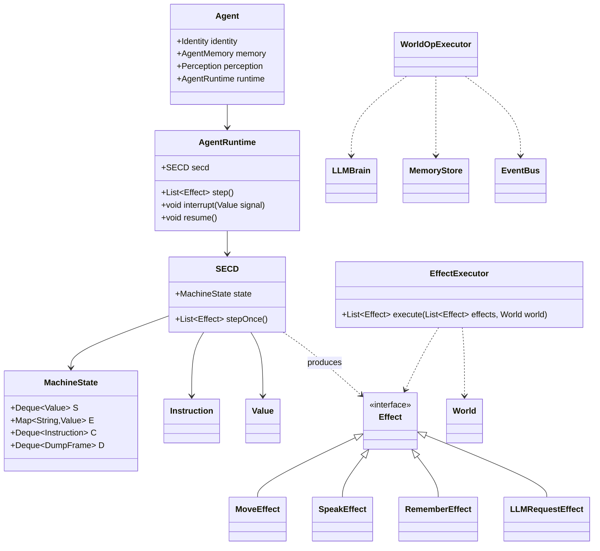

# SECD 行为运行时 × Virtual AI Box —— 融合设计方案

> 版本：v0.2（评审修订稿）
> 依据：`docs/my_opinion.md` 审查意见逐条落实
> 状态：待定稿

---

## 1. 项目定位（一句话）

> **这是一个以 SECD 为行为执行内核、以 World/Event 为运行环境、以 Memory 为认知状态、以 Effect 为副作用边界、以 LLM 为非确定性 Oracle 的多智能体沙盒。**

---

## 2. 定位修正（落实评审 §1）

- ~~"把每个 Agent 变成一台 SECD 抽象机"~~ —— 不采用。
- 准确表述：

> **每个 Agent 拥有一个基于 SECD 的行为运行时（Agent Runtime），负责执行可组合、可中断、可恢复的行为程序。**

- **SECD 是 Agent 的行为执行内核，而不是 Agent 本身。**
- 由此，原 AI 小镇、Tick、EventBus、Memory、Agent 与 SECD 抽象机**都不被推翻**，各自进入清晰位置。

---

## 3. 职责划分（落实评审 §4）

| 关注点 | 归属 |
|---|---|
| 行为控制流 | **SECD**（确定性执行内核） |
| 世界状态 | **World**（运行环境） |
| 记忆 | **Memory**（外部认知状态） |
| 不确定性 | **LLM**（非确定性 Oracle） |
| 副作用边界 | **Effect**（意图/副作用描述） |

> **Deterministic Runtime + Non-deterministic Oracle**

```text
SECD
 ↓ 执行确定性的行为程序
 ↓ 遇到 ask-llm
LLM
 ↓ 返回结果
 ↓ 继续 SECD
```

---

## 4. S/E/C/D 保持 SECD 原始语义（落实评审 §2）

**不把 S/E/C/D 强行等同于记忆、人格。** 四个寄存器只表达"当前行为执行的机械状态"：

| 寄存器 | 真正职责 |
|---|---|
| **S** | 当前计算过程中的**值栈** |
| **E** | 当前程序的**词法环境 / 闭包环境** |
| **C** | 当前正在执行的**行为程序**（指令序列） |
| **D** | **continuation**：被挂起的执行上下文 |

Agent 的组成（认知状态与执行状态分离）：

```text
Agent
├── Identity / Personality    （身份/人格，静态）
├── AgentMemory               （记忆，外部认知状态）
├── Perception                （感知，输入通道）
└── AgentRuntime              （行为执行内核）
     └── SECD                 （S / E / C / D）
```

**重要约束：Memory ≠ E，ShortTermMemory ≠ S。**
Memory 是外部认知状态（AgentMemory/MemoryStore），SECD 是行为执行状态（S/E/C/D）。两者之间只通过 Effect 与指令原语交换数据，不做概念合并。

---

## 5. 技术亮点：D 栈 = Interrupt → Handle → Resume（落实评审 §3）

这是整个融合最有价值、最值得深挖的能力，保留并作为项目技术亮点：

```text
Alice：move east; move east; move east
      ↓
Bob 出现（World Event 触发）
      ↓
AgentRuntime：
  D.push(当前执行上下文)
      ↓
  执行 onMeet(Bob)
      ↓
  对话结束
      ↓
  resume()
      ↓
  继续 move east
```

这让 Agent 真正拥有 **Interrupt → Handle Event → Resume**，而不再是每个 tick 都让 LLM 猜"我现在应该干什么"。

---

## 6. LLM 是 Oracle，不是 Runtime（落实评审 §4）

保留原文档最重要的思想：

> **LLM 是 Oracle，而不是 Agent Runtime。**

```text
行为控制流 → SECD
世界状态   → World
记忆       → Memory
不确定性   → LLM
```

LLM 只在 `ask-llm` 原语处被调用一次，把结果作为值返回 SECD 继续执行。控制流全部由机器保证。

---

## 7. Effect 层：隔离 SECD 与世界副作用（落实评审 §5）

**禁止 SECD 直接修改 World。** 单向数据流：

```text
SECD
 ↓ 产生 Effect（意图/副作用描述）
Tick / Effect Executor
 ↓ 真正执行副作用
修改 World
```

Effect 类型（v0）：

```text
MoveEffect      → Movement（对应现有 MoveAction）
SpeakEffect     → EventBus 广播
RememberEffect  → Memory（AgentMemory/MemoryStore）
LLMRequest      → LLM（ask-llm 的副作用化）
ObserveEffect   → Perception → S 栈
```

对应关系：

```text
SECD          = 计算
Effect        = 意图/副作用描述
EffectExecutor = 真正执行副作用
WorldState    = 世界状态
```

**收益**：原有 5 阶段 Tick 骨架完整保留 —— `decisionPhase` 产出 Effects，`executionPhase` 由 EffectExecutor 落地。

---

## 8. 交互触发链（严谨表述，落实评审 §6）

不宣称"Agent 交互本质上就是 β-归约"，改为：

> **世界事件可以触发 Agent 行为闭包的应用，并由 SECD 执行归约。**

```text
Agent 相遇
    ↓
World Event
    ↓
找到 A.onMeet
    ↓
apply(onMeet, B)
    ↓
SECD reduction
    ↓
Effects
    ↓
World
```

既保留理论特色，又不把 λ 演算与社会交互强行画等号。

---

## 9. 收敛：不动点 / 稳定性 / 活锁检测（落实评审 §7）

**不把"AI 小镇 = λ 演算 normalization"当严格理论**（动态系统不一定存在 normal form）。归一化思想保留，工程实现表述为：

| 工程概念 | 含义 | 检测事件 |
|---|---|---|
| **Fixed Point / Stability** | `WorldState(t)` 长期无变化 | `WorldConverged` |
| **Loop Detection** | 状态进入周期 `A→B→A→B→…` | `AgentLoop` / `AgentStuck` |

```text
WorldState(t)   →   WorldState(t+1)   →   WorldState(t+2)
       长期无变化 → WorldConverged
       A→B→A→B…  → AgentLoop / AgentStuck
```

---

## 10. 行为 DSL v0（最小范围，草案，落实评审 §8）

第一阶段**不做**完整编程语言（Lexer/Parser/AST/TypeSystem）。只支持：

```text
move  speak  observe  remember  ask-llm
sequence  if  lambda  apply
```

目标管线先跑通：

```text
.lambda → Parser → Compiler → SECD → Effect → World
```

> ⚠️ **状态标注：行为 DSL 是草案，不是项目核心。** 语法后续可调整。

### 10.1 语法（v0，已与示例对齐）

```text
program   := topLevel+
topLevel  := def (';')? | plan (';')?
def       := NAME '=' expr
plan      := 'plan' '=' expr
expr      := INT | STRING | NAME | DIRECTION
           | op
           | '(' expr expr ')'                     # 应用
           | ('λ'|'lambda'|'L') NAME '.' expr      # 抽象
           | 'let' NAME '=' expr 'in' expr
           | 'if' expr 'then' expr 'else' expr
           | '{' expr (';' expr)* '}'              # 顺序 → InstSeq
op        := 'move' | 'speak' | 'observe' | 'remember' | 'ask-llm'
           | 'name-of' | 'dist-to'
DIRECTION := 'north' | 'east' | 'south' | 'west'    # 由 EffectExecutor 映射为 delta
```

### 10.2 示例：Alice（与语法严格一致）

```text
# Alice.lambda
persona   = λ p. (remember (name-of p) "met")
assistant = λ p. (speak p (ask-llm p))
explore   = λ d. (move d)
onMeet    = λ p. { persona p; assistant p }
onIdle    = λ d. { explore d }
plan      = { onIdle east; onIdle east; onIdle north; onIdle north }
```

- 规则都是**值**（闭包），可组合：`onMeet` = `persona` 与 `assistant` 的复合。
- 解析器选型维持 v0.1 结论：**手写递归下降解析器**，不引入 ANTLR 依赖。

---

## 11. 总体架构（评审最终版）

```
                         Virtual AI Box
                              │
                         World Engine
                              │
                             Tick
                              │
              ┌───────────────┴───────────────┐
              │                               │
           Agent A                         Agent B
              │                               │
        ┌─────┴─────┐                   ┌─────┴─────┐
        │ AgentMind  │                   │ AgentMind  │
        │            │                   │            │
        │   SECD     │                   │   SECD     │
        │ S E C D    │                   │ S E C D    │
        └─────┬──────┘                   └─────┬──────┘
              │                               │
              └─────────── Effects ───────────┘
                              │
                       Effect Executor
                              │
                ┌─────────────┼─────────────┐
                ↓             ↓             ↓
             Movement      EventBus       Memory
                │             │             │
                └─────────────┼─────────────┘
                              ↓
                         WorldState


                     ┌──────────────┐
                     │     LLM      │
                     └──────┬───────┘
                            │
                        ask-llm()
                            │
                            ↓
                           SECD
```

---

## 12. 包结构设计（v0.2 修订）



包路径：`com.own.virtualaibox.secd`（移植）+ `com.own.virtualaibox.mind`（AgentRuntime / AgentMind / Perception）+ `com.own.virtualaibox.effect`（Effect 层，新增）+ `com.own.virtualaibox.dsl`（Parser / Compiler）。

> 注：评审图中 Agent 内层叫 `AgentMind`，本方案的 `AgentRuntime` 与 `AgentMind` 等价，命名以定稿时二选一。

---

## 13. 迁移路线（移植 + 精简）

沿用 v0.1 结论，按"移植 + 精简"落地。

### 13.1 直接移植（语义不变，仅调包名/泛型，兼容 Java 21）

| lambdaexpr 文件 | 目标 | 说明 |
|---|---|---|
| `instruction/Instruction.java` | `secd/Instruction.java` | 标记接口 |
| `InstConst / InstVar / InstLam / InstApp / InstApply` | `secd/*.java` | 原样 |
| `value/Value.java` | `secd/value/Value.java` | 原样 |
| `IntValue / VarValue / OpValue / PartialOpValue / ClosureValue / InfiniteValue` | `secd/value/*.java` | 原样 |
| `core/SECDMachine.java` | `secd/SECD.java` + `secd/MachineState.java` | **拆分**：状态与驱动分离，去掉 ANTLR 耦合；`step()` 改为**产出 Effect** |
| `core/DumpItem.java` | `secd/DumpFrame.java` | 重命名 |

### 13.2 精简 / 重写
| lambdaexpr 文件 | 处理 |
|---|---|
| `gen/*`（ANTLR 生成） | **删除**，由手写 `dsl/BehaviorParser` 取代 |
| `core/ASTBuilder.java`（α-改名） | 重写为 `dsl/BehaviorCompiler`（命名变量，作用域卫生） |
| `Main.java`（Swing UI） | **删除** |
| 无限归约启发式 | 提炼进 `ConvergenceMonitor`（§9） |

### 13.3 依赖与构建
- **不引入 ANTLR**（手写解析器），`pom.xml` 无需新增运行时依赖。
- 保留 `ClosureValue.toString()` 递归打印（前端摘要需要）。
- 移植源 Java 11 → 本项目 Java 21，无兼容问题。

---

## 14. 实现阶段

| 阶段 | 内容 | 验收 |
|---|---|---|
| **P0 移植** | SECD 核心移植进 `com.own.virtualaibox.secd`，拆分 `MachineState`/`SECD`，`step()` 产出 Effect | 移植原 `JunitTest` 用例通过；`step()` 不再直接改 World，只产出 Effect |
| **P1 运行时** | `AgentRuntime` + Effect 层 + `EffectExecutor`；每 Agent 一个 SECD；decisionPhase → Effects → executionPhase 落地 | 心智驱动代替直接 LLM 决策，世界仍能跑动；行为控制流与副作用完全隔离 |
| **P2 中断/恢复** | World Event → apply(onMeet) → `interrupt/resume` | 相遇出现对话；Agent 计划可被中断并恢复（单测验证 D 栈出入） |
| **P3 收敛检测** | `ConvergenceMonitor` + `WorldConverged` / `AgentLoop` / `AgentStuck` | 构造"原地打转/周期振荡"Agent，能检出 |
| **P4 可视化** | dashboard 暴露 SECD 状态（S/E/C/D 摘要 + 状态）；`MindViewer` + 收敛指示器 | 前端可见每 Agent 的行为执行状态 |
| **P5 配置化** | `resources/agents/*.lambda` 启动加载 | 改 `.lambda` 文件重启即变人格，无需改代码 |

每阶段保持可运行、可回退（配置开关）。

---

## 15. 风险与缓解

| 风险 | 缓解 |
|---|---|
| LLM 非确定性破坏机械可靠承诺 | LLM 只填 `ask-llm` 一个洞；控制流由 SECD 保证（§6） |
| SECD 直接改 World 造成耦合 | **Effect 层硬隔离**（§7），单向数据流 |
| D 栈无限增长 / 深递归 | 沿用 `MAX_STEPS` + D 栈增长监控（P3） |
| 记忆与执行状态概念混淆 | 明确 Memory ≠ E，只经 Effect/原语交换数据（§4） |
| 相遇频繁导致抖动 | 同 tick 同 pair 只应用一次；可配相遇冷却 |
| DSL 过度设计 | DSL 标注草案，只做最小原语集（§10），跑通管线优先 |

---

## 16. 后续扩展（非本次范围）

- **社会关系图 = 归约网络**：人际网络建模为闭包应用图。
- **反事实推演**：利用 D 栈做"如果没被打断会怎样"的分支回放。
- **行为进化**：闭包的组合/改名做 λ 项交叉变异，自动演化人格。
- **世界回放**：MachineState 序列化支持世界级时间旅行。

---

## 附：与 lambdaexpr 原项目的关系

- lambdaexpr 作为**语义参考实现**保留原样。
- VirtualAIBox 通过"移植 + 精简"引入机器核心为 `com.own.virtualaibox.secd`。
- SECD 本体若演进，可回灌 lambdaexpr `core/`，两边同步。
